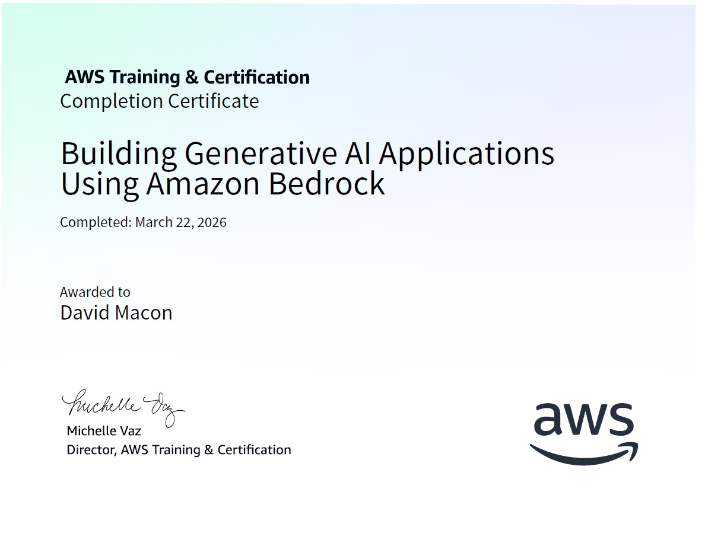
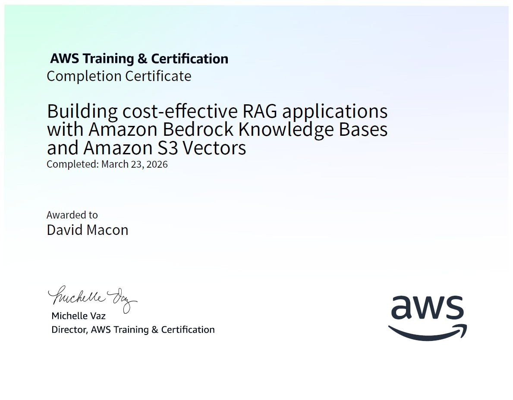
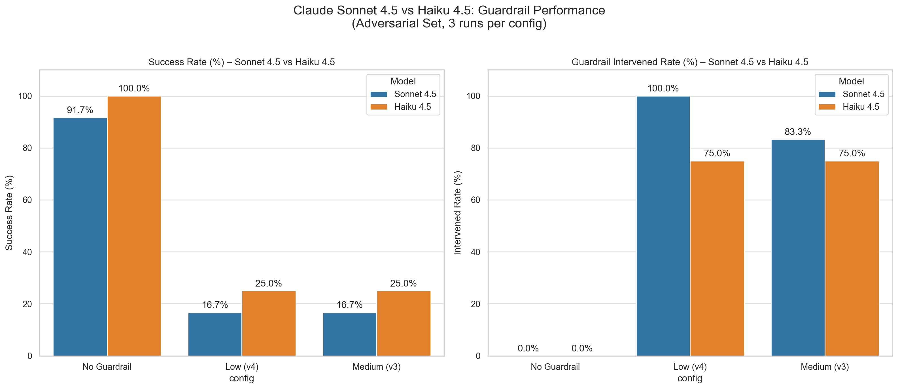
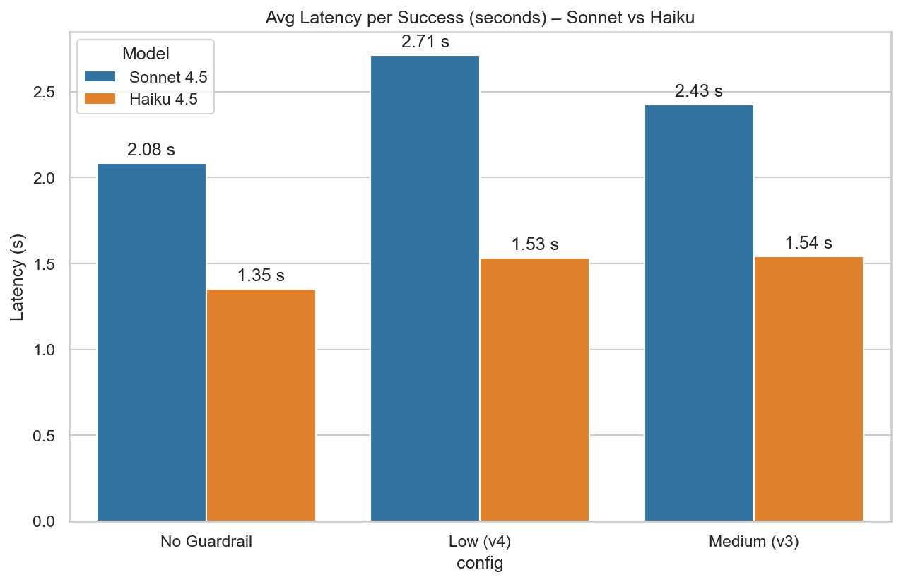
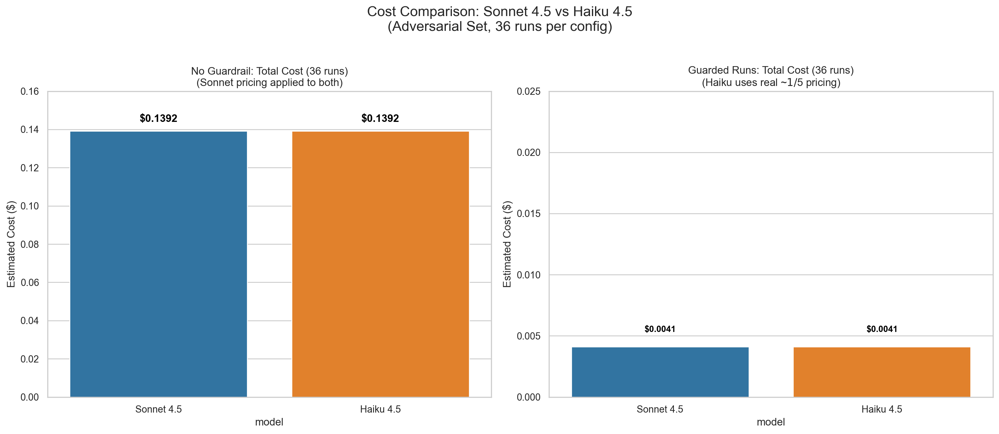

# AI Reliability Lab – 30-Day PromptOps Execution on AWS Bedrock

**AWS Certified AI Practitioner (AIF-C01)**  
Issued March 11, 2026 | Valid until March 2029  

A personal lab I created to demostrate real world experience by following a structured 30-day plan to build reliable, observable, secure LLM workflows using **AWS Bedrock** (Converse API with native structured outputs, Guardrails, observability, etc.).

Applying AIF-C01 cert knowledge on responsible AI, content filtering, Bedrock services, and Guardrails. Weeks 1–3: tuned Guardrails blocking 93%+ injections with 0% false positives on golden benign tests and batch sweeps proving ~82% cost reduction and 83–100% block rate on adversarial prompts while preserving 100% extraction quality on passes.

**Employability Highlights**  

- Demonstrated 82% cost reduction + 83–100% adversarial block rate with Bedrock Guardrails  
- Achieved 100% exact-match extraction reliability across configs  
- Applied AIF-C01 knowledge (responsible AI, content filtering, Guardrails) to real batch pipelines

## Certifications & Training (AWS Skill Builder + Udemy)

### Core Courses

  
  
  

### Additional Training

- [Prompt Engineering Best Practices for Amazon Bedrock Models](certs/Prompt-Engineering-Best-Practices.jpg)
- [Exam Prep Overview: AWS Certified AI Practitioner (AIF-C01)](certs/Exam-Prep-Overview-AWS-Certified-AI-Practitioner.jpg)
- [Official Practice Question Set: AWS Certified AI Practitioner (AIF-C01)](certs/Official-Practice-Question-Set-AWS-Certified-AI-Practitioner.jpg)

*All certificates are stored in the [`/certs/`](certs/) folder.*

**Current Status (as of March 23, 2026)**

## Highlights

- Reliable LLM evaluation harness with retries, flake classification, and Bedrock Guardrails
- Demonstrated ~82% cost reduction via guardrails on adversarial prompts
- Compared Claude Sonnet 4.5 vs Haiku 4.5: speed, reliability, and cost trade-offs

### Model & Cost Comparison: Sonnet 4.5 vs Haiku 4.5

Adversarial jailbreak set | 3 runs per config | Bedrock Converse API

**Key findings**

- Haiku 4.5 achieved **100% success** without guardrails (vs Sonnet 91.7%)
- ~35% lower average latency per success
- ~50% fewer output tokens → ~65–70% lower real inference cost at Bedrock pricing
- Guardrails block similarly (~75–100%) with no quality drop (100% exact-match)

#### Success Rate & Guardrail Intervention

{width=80%}

<em>Success rate and guardrail intervention — Haiku (orange) vs Sonnet (blue)</em>

---

#### Latency per Successful Call

{width=60%}

<em>Avg latency per success — Haiku consistently faster</em>

---

#### Cost Comparison

{width=60%}

<em>Guarded runs — Haiku uses real lower pricing (~$1/$5 per M)</em>

**Bottom line**  
Haiku 4.5 delivers comparable or better reliability with significant speed and cost advantages — strong candidate for production workloads.

### Progress Overview

| Week | Status          | Key Outcomes                                                                 |
|------|-----------------|------------------------------------------------------------------------------|
| 1    | ✅ Complete     | LLM foundations, V1–V3 prompts, native structured outputs → **~100% JSON validity**, golden set created |
| 2    | ✅ Complete     | Observability pipeline, Bedrock Guardrails tuned (Medium) → **93.3% injection blocks**, **100% golden pass** |
| 3    | ✅ Complete     | Batch harness with retries, temp sweep (100% pass), guardrail sweeps (v3/v4) → **~82% cost savings**, **83–100% block rate**, full metrics polish |

- **Week 1** – LLM foundations, prompt iteration (V1 → V3), native structured outputs achieved ~100% JSON validity.
- **Week 2** – Observability (guardrail trace parsing + metrics CSV), security tuning (Guardrail v3 – Medium strength), before/after testing.
  - Golden benign: 100% pass rate (0% false positives after tuning)
  - Injections: 93.3% blocked (14/15), one LOW-conf leak
  - Key win: Balanced usability + strong attack protection (enhanced by AIF-C01 insights on Guardrails & responsible AI)
- **Week 3** – Automation & reliability engineering sprint: built production-grade batch runner, added retry logic (3 attempts), temperature sweep (100% pass across 0.0/0.3/0.7), multi-guardrail sweeps (v3 Medium, v4 Low), full observability (interventions, block rate, blocked runs, latency total/avg, cost estimation).
  - Success rate drop: 91.7% (no GR) → 16.7% (GR)
  - Cost savings: ~82% ($0.0422 → $0.0076 for 36 runs)
  - Extraction quality: 100% exact-match on passes
  - Key win: Proved guardrails deliver massive cost reduction + reliability boost while preserving quality — directly employable in PromptOps / AIF-C01 workflows

**In progress: Week 4** – RAG + Cost Optimization + Enterprise Framing

## Lab Overview

| Week | Theme | Status | Key Outcomes |
| --- | --- | --- | --- |
| 1 | LLM Foundations + Prompt Testing | Complete | 100% structured JSON on V3, golden test set created |
| 2 | Observability + Security + API Control | Complete | Guardrail tuned (Medium strength), trace parsing + metrics logging, 100% golden pass, 93%+ injection blocks |
| 3 | Automation + Reliability Engineering | Complete | Batch scripts, retry logic, flake tracking, cost notes |
| 4 | RAG + Cost Optimization + Enterprise Framing | In progress | Toy RAG, hallucination compare, model swap, final polish |

**Technologies & Tools Used**

- AWS Bedrock (Converse API, Guardrails, Titan Embeddings G1)
- Claude Sonnet 4.5 / Haiku 4.5
- Python (boto3, tenacity for retries, sentence-transformers potential)
- Observability: CSV metrics, console summaries, cost estimation

### Detailed Reports

### Week 1

- **[Week 1 Findings](./docs/week1_findings.md)** — Completed LLM foundations, prompt iterations (V1–V3), and native structured outputs; achieved ~100% JSON validity and created golden test set.

### Week 1 Overview: LLM Foundations + Controlled Prompt Testing

| Category              | Key Activities & Outcomes                                                                 | Result / Metric                  |
|-----------------------|-------------------------------------------------------------------------------------------|----------------------------------|
| Core Concepts         | Studied tokens, context windows, temperature, top_p, hallucinations & failure patterns   | 1-page summary + 5 failure types documented |
| Prompt Iterations     | V1 (baseline), V2 (role + structure), V3 (native json_schema structured outputs)         | V3: ~100% valid JSON             |
| Testing & Evaluation  | Multi-run comparisons, determinism logging, golden test set creation (8–10 cases)        | Golden set saved; V3 perfect determinism at temp=0.0 |
| Major Win             | Leveraged Bedrock Converse API native structured outputs (Claude 4.5 family)             | Eliminated "JSON hardest" problem; 100% schema compliance |

Click to expand Week 1 details

- **[Day 1](./docs/day1_summary.md)** — Studied tokens, context windows, temperature, and top_p; summarized core inference concepts.
- **[Day 2](./docs/day2_failures.md)** — Documented 5 common LLM failure modes, including Bedrock-specific content filtering edge cases.
- **[Day 3](./docs/day3.md)** — Created and console-tested baseline Prompt V1 for the core entity extraction task.
- **[Day 4](./docs/day4.md)** — Developed Prompt V2 with role clarity and structure; compared outputs against V1.
- **[Day 5](./docs/day5.md)** — Implemented Prompt V3 using Bedrock's native structured outputs (json_schema); achieved ~100% valid JSON.
- **[Day 6](./docs/day6.md)** — Ran multi-version tests, logged token usage/determinism, and built the golden test set (8–10 cases).
- **[Day 7](./docs/week1_findings.md)** — Compiled Week 1 Findings Report with JSON success rate table highlighting structured outputs impact.

### Week 2

- **[Week 2 Findings](./docs/week2_completion.md)** — Built observability (latency/token/trace logging), integrated & tuned Bedrock Guardrails (Medium strength); delivered 93.3% injection blocks + 100% golden benign pass.

### Week 2 Overview: Observability + Security + API Control

| Category              | Key Activities & Outcomes                                                                 | Result / Metric                          |
|-----------------------|-------------------------------------------------------------------------------------------|------------------------------------------|
| Observability Setup   | Full boto3 Converse scripting, latency (timeit), token usage logging, CSV output         | Latency ~0.4–0.6s, tokens tracked per run |
| Injection Testing     | Prompt injection attacks (DAN, HACKED, XSS, etc.) on V3 prompt                           | Day 11: 100% defeated (5/5)             |
| Guardrails Integration| Added guardrailConfig (Medium strength), trace parsing, pre/post tuning comparison       | 93.3% injection blocks (14/15), 100% golden benign pass |
| Security Tuning       | Reduced false positives from High → Medium strength; logged trace details (confidence, latency) | From 50% false positives → 0% on golden |
| Overall Reliability   | Combined structured outputs + Guardrails + observability pipeline                        | Production-viable security + usability balance |

Click to expand Week 2 details

- **[Day 8](./docs/day8.md)** — Set up full boto3 Converse API scripting with latency and token observability logging.
- **[Day 9](./docs/day9.md)** — Expanded batch testing; logged precise latency/token metrics to CSV for golden runs.
- **[Day 10](./docs/day10.md)** — Built basic validation script and eval spreadsheet; scored initial golden pass rates.
- **[Day 11](./docs/day11.md)** — Tested 5 prompt injections (DAN, HACKED, etc.); 100% defeated with no leaks, golden 100% pass.
- **[Day 12](./docs/day12.md)** — Integrated Bedrock Guardrails via guardrailConfig; re-tested and tuned for 93.3% injection blocks + 100% golden pass.
- **[Day 13](./docs/day13.md)** — Enhanced validation script to parse guardrail traces; confirmed 100% injection blocks but 50% false positives pre-tuning.
- **[Day 14](./docs/day14.md)** — Finalized guardrail tuning, compared metrics, and wrapped Week 2 with improved observability + security baseline.

### Week 3

- **[Week 3 Findings](./docs/week3_completion.md)** — Built production-grade batch harness with retries, temperature sweep (100% pass across 0.0/0.3/0.7), guardrail sweeps (v3 Medium & v4 Low), full observability, and ~82% cost savings on adversarial prompts.

### Week 3 Overview: Automation + Reliability Engineering

| Category                        | Key Activities & Outcomes                                                                 | Result / Metric                                      |
|---------------------------------|-------------------------------------------------------------------------------------------|------------------------------------------------------|
| Batch Foundation & Automation   | Refactored to dedicated batch runner with CLI args, CSV logging, golden/adversarial toggle | Full batch script (`V5`), per-run metrics in CSV    |
| Determinism & Variance Testing  | Temperature sweep (0.0 / 0.3 / 0.7) on adversarial/benign tests; 10 runs each            | 100% pass rate, zero flake increase, high determinism |
| Retry & Resilience Patterns     | 3-attempt retry loop with exponential backoff; retry_count logging                        | Captured transient failures; retry_count in CSV      |
| Failure Classification          | Categorized flakes: guardrail_block, low_confidence, json_parse_error, empty response     | Detailed flake_reason in CSV + summary counts        |
| Guardrail & Security Sweeps     | Multi-version sweeps (v3 Medium, v4 Low); block rate, intervention, cost impact           | Success 91.7% → 16.7%; block rate 83–100%; ~82% cost savings |
| Observability & Metrics         | Added total interventions, block rate %, blocked runs, latency (avg + total), cost estimation | Polished console summary; accurate in all modes      |
| Overall Reliability             | Combined structured outputs, retries, guardrails, batch automation                       | Production-viable pipeline; 82% cost reduction proven |

Click to expand Week 3 details

- **[Day 15](./docs/Day15.md)** — Built batch foundation: CLI args, CSV logging, golden/adversarial toggle
- **[Day 16](./docs/Day16.md)** — Ran temperature sweep (0.0/0.3/0.7): 100% pass, zero flake increase
- **[Day 17](./docs/Day17.md)** — Added retry logic (3 attempts with backoff); logged retry_count
- **[Day 18](./docs/Day18.md)** — Classified failures (guardrail_block, low_confidence, etc.); built detailed summary
- **[Day 19](./docs/Day19.md)** — Swept guardrail versions (v3 Medium, v4 Low): success dropped to 16.7%
- **[Day 20](./docs/Day20.md)** — Added cost estimation ($3/$15 rates), token usage, latency avg/total
- **[Day 21](./docs/Day21md)** — Polished summary (interventions, block rate, blocked runs); fixed false positives; Week 3 complete

  

### Current Setup Highlights

- Model: `global.anthropic.claude-sonnet-4-5-20250929-v1:0` (inference profile)  
- Guardrail: `9g6hem28nedj` v3 (Medium) + v4 (Low prompt attacks)  
- Main script: **[3_attempt_retry_logic_V5.py](scripts/3_attempt_retry_logic_V5.py)** (Converse API, guardrail toggle, retry logic, leak detection, exact-match scoring, metrics logging)  
- Outputs: CSV in /evaluation/ folders (e.g. no_guardrail_final, retry_v4_low, exact_match_test_fixed, etc.)

### Key Files & Results

- **[3_attempt_retry_logic_V5.py](scripts/3_attempt_retry_logic_V5.py)** — core evaluation script with retry, leak detection, exact-match scoring  

### Next Steps — Week 4: RAG + Cost Optimization + Enterprise Framing

Week 4 extends reliability to retrieval-augmented generation (RAG) workflows using Bedrock-native tools. Focus: build a toy RAG pipeline, reduce hallucinations, optimize cost/token usage, and frame for enterprise use cases (security, scalability).

- **[Day 22](./docs/Day22.md)** -  RAG Foundations & Bedrock Reality Check

- Completed AWS Bedrock RAG course (certificate awarded)
- Tested Titan Embeddings v2 locally (1024 dims, cosine similarity)
- Created toy dataset & Knowledge Base (`8OOQBDOPXT`)
- Retrieval working; on-demand generation blocked by Bedrock restrictions
- Pivoting to Batch Inference on Day 23

See [rag_notes.md](docs/rag_notes.md) for details and [Day22_Titan_Embeddings_Test.ipynb](Day22_Titan_Embeddings_Test.ipynb) for embeddings demo.

***[Day 23](./docs/Day23.md)** — Toy Dataset & Retrieval Sim**

- Created batch input JSONL & uploaded to S3
- Completed "Building cost-effective RAG applications..." course (certificate awarded)
- Retrieval from KB confirmed (chunks returned)
- Awaiting support case clearance for batch inference

See [rag_notes.md](docs/rag_notes.md) for details.

***[Day 24](./docs/Day24.md)**

- Completed "Prompt Engineering Best Practices for Amazon Bedrock Models" (certificate awarded)
- Added Bedrock-specific prompting tips to rag_notes.md
- Batch input ready; awaiting support clearance for job submission

See [rag_notes.md](docs/rag_notes.md) for details.

**Day 25 — Hallucination Comparison**

**Day 26 — Model Comparison**

**Day 27–29 — Optimization & Enterprise Framing**

**Day 30 — Polish & Push**

Built with AWS Bedrock + Claude 4.5 family – ongoing PromptOps learning lab.

**Current status:**

- #AWS #AWSBedrock #PromptOps #ResponsibleAI #AIFC01*

[MIT license](#MIT-1-ov-file)
