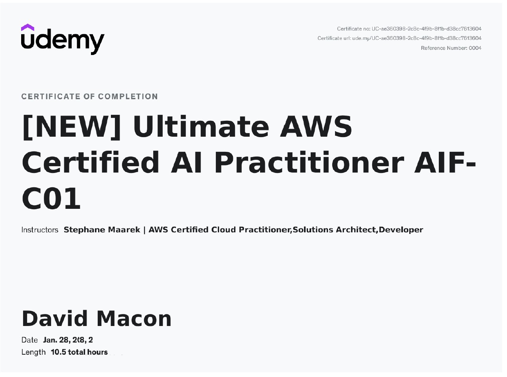

# AI Reliability Lab

A personal lab I created to demonstrate real world experience by following a structured 30-day plan to build reliable, observable, secure LLM workflows using AWS Bedrock (Converse API with native structured outputs, Guardrails, observability, etc.).

Applying AIF-C01 cert knowledge on responsible AI, content filtering, Bedrock services, and Guardrails. Weeks 1–3: tuned Guardrails blocking 93%+ injections with 0% false positives on golden benign tests and batch sweeps proving ~82% cost reduction and 83–100% block rate on adversarial prompts while preserving 100% extraction quality on passes.

## Certifications & Training (AWS Skill Builder - March 2026)

### Core Courses

  
  
  

### Additional Training

- [Prompt Engineering Best Practices for Amazon Bedrock Models](certs/Prompt-Engineering-Best-Practices.jpg)
- [Exam Prep Overview: AWS Certified AI Practitioner (AIF-C01)](certs/Exam-Prep-Overview-AWS-Certified-AI-Practitioner.jpg)
- [Official Practice Question Set: AWS Certified AI Practitioner (AIF-C01)](certs/Official-Practice-Question-Set-AWS-Certified-AI-Practitioner.jpg)

*All certificates are stored in the [`/certs/`](certs/) folder.*

## Week 4 – RAG Foundations & Real-World AWS Constraints (March 22–25, 2026)

**Summary**  
Built and synced a functional Bedrock Knowledge Base (`8OOQBDOPXT`), tested Titan Embeddings v2 locally, created batch input infrastructure, and performed manual RAG simulation while navigating on-demand generation restrictions. Completed 8 AWS Skill Builder courses. Documented production realities and workarounds.

**Daily Progress**

- **Day 22 (March 22)**: Completed "Building Generative AI Applications Using Amazon Bedrock" course. Tested Titan Embeddings v2, created toy dataset, uploaded to S3, and built Knowledge Base. Retrieval validated.
- **Day 23 (March 23)**: Created `batch_queries.jsonl` and uploaded to S3. Completed "Building cost-effective RAG applications with Amazon Bedrock Knowledge Bases and Amazon S3 Vectors" course. Retrieval from KB confirmed.
- **Day 24 (March 24)**: Completed "Prompt Engineering Best Practices for Amazon Bedrock Models" course. Added prompting takeaways to rag_notes.md.
- **Day 25 (March 24)**: Completed "Amazon Bedrock Getting Started" course. Updated rag_notes.md.
- **Day 26 (March 24)**: Ran baseline (no context) using batch script. Prepared manual RAG simulation with retrieved KB chunks.
- **Day 27 (March 24)**: Completed "Developing Generative Artificial Intelligence Solutions" course. Performed manual RAG simulation.
- **Day 28 (March 25)**: Performed cost analysis (baseline vs RAG) and added Guardrails on RAG notes.
- **Day 29 (March 24–25)**: Completed "Designing Secure Retrieval Augmented Generation (RAG) Applications with AWS" and "Foundations of Prompt Engineering". Added enterprise security and advanced prompting notes.

**Final Week 4 Report**: [Week_4_RAG_Report.md](docs/Week_4_RAG_Report.md)

**Status**  
Week 4 (RAG Foundations) successfully completed on March 25, 2026 despite on-demand generation restrictions. Ready for job applications.

---

**Repository**: <https://github.com/David-Macon-code/ai-reliability-lab>

Built as part of the 30-Day AI Bootcamp focused on reliable, observable, and secure LLM workflows using AWS Bedrock.
